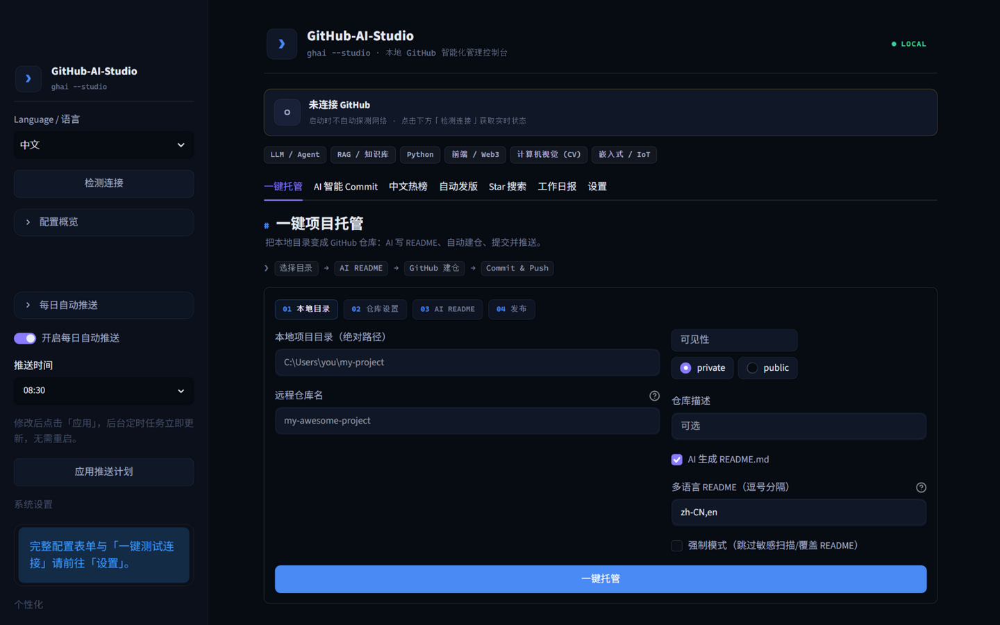
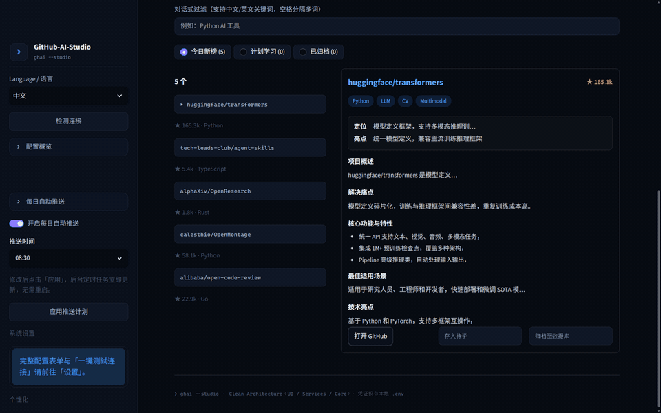
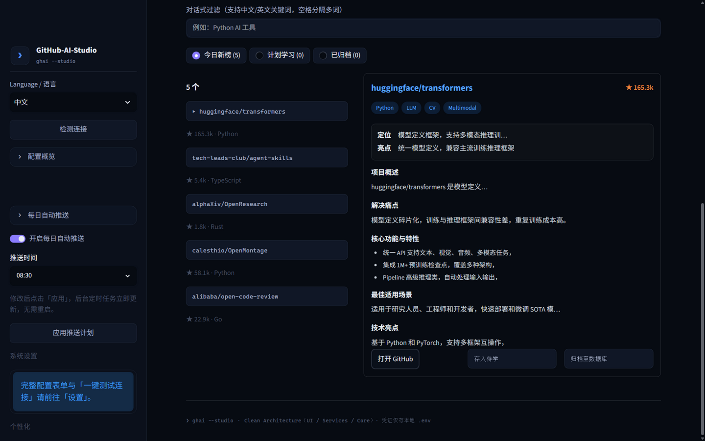
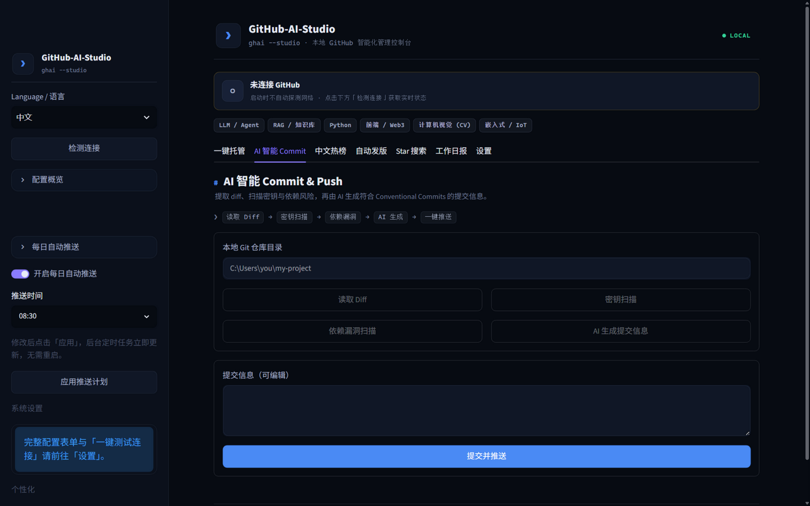
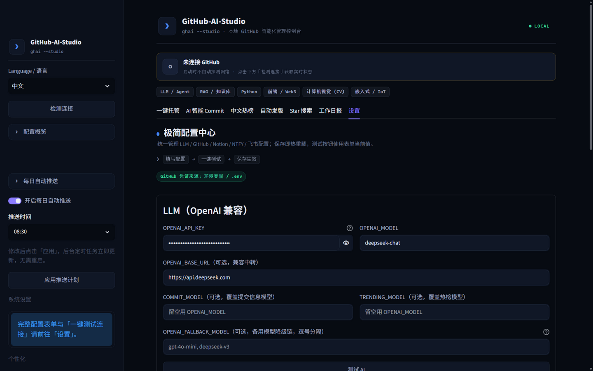
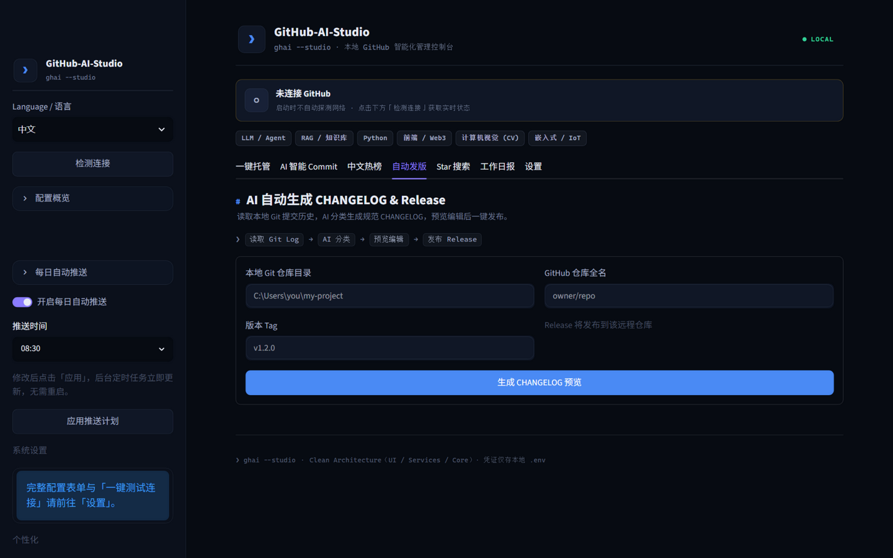
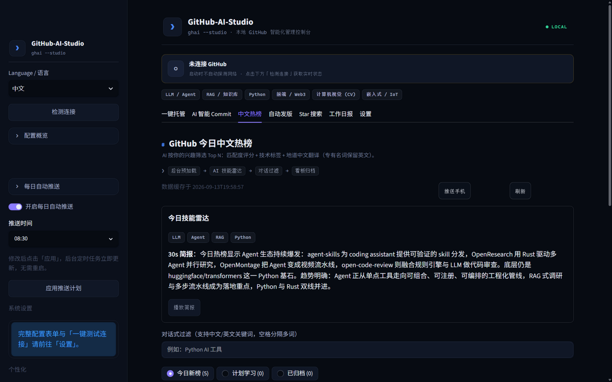
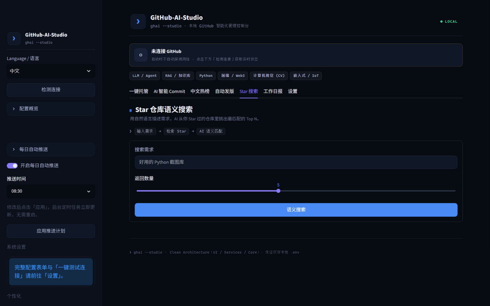
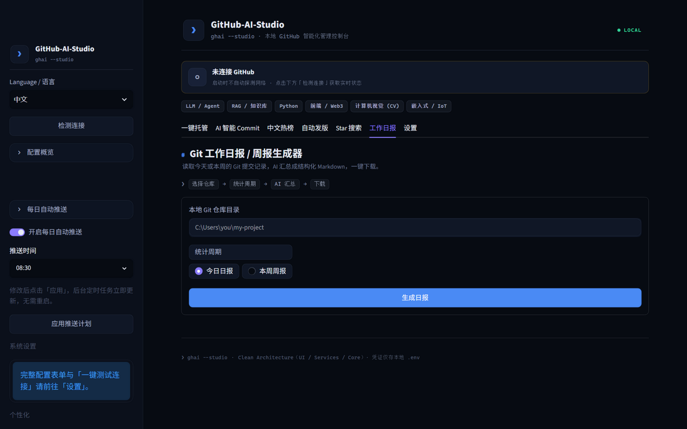

# GitHub-AI-Studio

[](https://github.com/Tsubasa-Kaede/GitHub-AI-Studio/actions/workflows/ci.yml)

独立桌面窗口界面的本地 GitHub 智能化管理控制台与后台助手。

<p align="center">
  
</p>

<p align="center">
  
</p>
<p align="center"><sub>▲ 热榜看板交互演示：存入待学 → 计划学习 → 移回新榜</sub></p>

- **独立桌面窗口**：PyWebView 内嵌 Streamlit（深色主题、7 大功能 Tab），与网页版渲染完全一致
- **Clean Architecture**：UI / Services / Core / Models 严格分层，桌面、托盘、CLI 共用同一套流水线
- **AI 结构化输出**：Commit / README(i18n) / CHANGELOG / 热榜翻译 / 日报全部走 OpenAI JSON 模式，无 Key 自动降级
- **中文热榜**：AI 匹配度评分 + 技术标签 + 防直译翻译 → 两阶段操作（先抓取翻译，再推送/归档）→ Ntfy 手机推送 → Notion 归档
- **安全引擎**：硬编码密钥扫描 + OSV 依赖漏洞扫描
- **托盘常驻**：pystray + schedule，每日 09:00 自动推送，一键唤起桌面控制台

## 界面预览

| **中文热榜看板** — 技能雷达 + 30s 简报 + 深度研读 | **AI 智能 Commit** — 密钥/漏洞扫描 + Conventional Commits |
| --- | --- |
|  |  |
| **极简设置** — 一键连通测试 + 按场景模型覆盖 | **自动发版** — Git 历史 → AI CHANGELOG → Release |
|  |  |

<details>
<summary><b>更多界面：一键托管 / 热榜雷达 / Star 搜索 / 工作日报（点击展开）</b></summary>

| | |
| --- | --- |
| **一键托管** — 本地目录 → AI 多语言 README → 建仓推送 | **中文热榜** — AI 技能雷达 + 30s 简报 + 对话式过滤 |
|  |  |
| **Star 语义搜索** — 自然语言检索你的 Star 仓库 | **工作日报** — 提交记录 → 结构化 Markdown 日报/周报 |
|  |  |

</details>

## 目录结构

```text
GitHub-AI-Studio/
├── app.py                   # Streamlit 主界面（7 大 Tab）
├── desktop_app.py           # 独立桌面窗口壳（PyWebView，主入口）
├── tray.py                  # 系统托盘常驻服务（pystray + schedule）
├── cli.py                   # 无头 CLI（定时任务 / CI 审查）
├── config.py                # 统一配置：gh CLI 凭证优先检测 + .env 读写
├── models.py                # DTO 数据模型（RepoInfo / TrendingRepo / WorkLog ...）
├── ui/                      # Streamlit 视图层
│   ├── components.py        # 侧边栏 / 缓存工厂 / 错误渲染
│   ├── theme.py             # 设计系统（深色主题 + 全局 CSS）
│   └── tab_*.py             # 7 大功能 Tab
├── services/                # 业务流水线层
│   ├── hosting_service.py   # 托管：init → README → 建仓 → push
│   ├── trending_service.py  # 热榜：两阶段（抓取翻译 / 推送归档）
│   ├── release_service.py   # 发版：Extract → Format → Publish
│   ├── star_search_service.py  # Star 语义搜索
│   └── worklog_service.py   # 工作日报
├── core/                    # 原子引擎层
│   ├── git_engine.py        # Git 操作
│   ├── github_client.py     # GitHub API
│   ├── ai_engine.py         # OpenAI 结构化输出（严禁直译专有名词）
│   ├── ntfy_engine.py       # Ntfy.sh 推送（通知栏 Actions 按钮）
│   ├── security_guard.py    # 密钥扫描 + OSV 依赖漏洞扫描
│   └── notion_engine.py     # Notion 归档
├── workflows/
│   └── ai_pr_reviewer.yml   # PR 自动 AI 审查
├── build_exe.py             # PyInstaller 单文件打包
└── requirements.txt
```

## 快速开始

```bash
pip install -r requirements.txt
copy .env.example .env       # Windows（macOS/Linux 用 cp）
# 编辑 .env 填入凭证；如果已 `gh auth login`，GITHUB_TOKEN 可留空

python desktop_app.py        # 启动独立桌面窗口控制台
```

## 控制台功能

| 桌面窗口 Tab | 功能 |
| --- | --- |
| 一键托管 | 本地目录 → AI 多语言 README（zh-CN/en/ja 可选）→ 建仓 → Commit & Push |
| AI Commit | 读取 diff → 密钥扫描 / OSV 依赖漏洞扫描 → AI Conventional Commits → 提交推送 |
| 中文热榜 | AI 评分 + 标签 + 防直译翻译 → 卡片 → Ntfy 推送 / Notion 归档 |
| 自动发版 | Git 日志 → AI CHANGELOG → 预览编辑 → 发布 GitHub Release |
| Star 搜索 | 自然语言提问 → AI 语义匹配你的 Star 仓库 |
| 工作日报 | 今天/本周提交 → AI 结构化日报 → 一键下载 |
| 设置 | 极简配置表单 + AI/GitHub/Notion/NTFY 一键连通测试，保存即热重载 |

设置入口在侧边栏（Token/Key 全部密码遮罩，保存即写回 `.env`）。

配置说明：
- `.env` 缺失时会从 `.env.example`（或内置模板）自动创建，不中断程序；
- GitHub Token 按「.env → `gh auth token` → `~/.config/gh/hosts.yml`」三级自动侦测；
- 「设置」Tab 内每个服务提供一键测试：测试按钮使用表单当前值，无需先保存；
- 保存后自动写入 `.env` 并清空 Streamlit 缓存，新配置立即生效。

性能策略：GitHub 状态检查改为「点击检测」+ 1 小时缓存，启动/刷新不再阻塞；
热榜采用两阶段交互（先抓取翻译、确认后再推送/归档），核心 Services 全部经 `@st.cache_resource` 复用。

## 系统托盘常驻服务（tray.py）

托盘服务让“每日 09:00 自动热榜推送”常驻后台，无需手动开界面：

```bash
python tray.py            # 开发调试
pythonw tray.py           # Windows 静默运行（推荐，无控制台窗口）
```

右键菜单：

| 菜单 | 行为 |
| --- | --- |
| 立刻抓取并推送 | 后台线程执行热榜流水线（Ntfy 推送 + Notion 归档），完成后 plyer Toast |
| 打开控制台 | 打开独立桌面窗口（打包 EXE 或 pythonw 运行 desktop_app.py） |
| 退出后台服务 | 停止每日调度、关闭 Streamlit 子进程、退出托盘 |

自定义时间：`python tray.py --time 08:30`

注意：托盘服务需要图形桌面会话（Windows/macOS 正常使用；纯服务器环境请改用 `cli.py --schedule-daily`）。

## CLI 与定时任务

```bash
# 无界面执行每日热榜流水线（抓取 + AI 翻译 + 推送 + Notion 归档）
python cli.py --daily-push

# 一键配置每日 09:00 定时任务（Windows 任务计划程序 / macOS-Linux Crontab）
python cli.py --schedule-daily

# 检查配置
python cli.py --check-config
```

## GitHub Actions：PR 自动审查

1. 把项目文件放入目标仓库（至少 `cli.py`、`config.py`、`core/`、`requirements.txt`、`workflows/`）。
2. 在仓库 Secrets 中配置 `OPENAI_API_KEY`。
3. 开启 PR 后自动审查并回复评论区；同一 PR 再次推送只更新报告，不刷屏。

## 打包为单文件 EXE

```bash
pip install pyinstaller
python build_exe.py
# 产物：dist/GitHub-AI-Studio.exe（免安装，双击即开独立桌面窗口）
```

打包后 `.env` 从 exe 所在目录读取，可把 `.env` 与 exe 放在同一文件夹使用。

## 环境变量

| 变量 | 必填 | 说明 |
| --- | --- | --- |
| `GITHUB_TOKEN` | 二选一 | 未配置时自动复用 `gh auth login` 凭证 |
| `OPENAI_API_KEY` | 建议 | 可填 OpenRouter / 硅基流动等 OpenAI 兼容服务 |
| `OPENAI_FALLBACK_MODEL` | 否 | 备用模型降级链（逗号分隔）：主模型限流/超时自动切换 |
| `COMMIT_MODEL` / `TRENDING_MODEL` | 否 | 按场景覆盖模型：提交信息 / 热榜翻译研读（留空用 OPENAI_MODEL） |
| `USER_INTERESTS` | 否 | 热榜筛选偏好，如 `AI Agent, Python, Rust` |
| `NTFY_TOPIC` / `NTFY_SERVER` | 否 | Ntfy 手机推送（推荐，通知栏可直接操作） |
| `DINGTALK_WEBHOOK` / `WECHAT_WEBHOOK` / `EMAIL_*` | 否 | 可选推送渠道：钉钉 / 企业微信 / 邮件 |
| `NTFY_ARCHIVE_WEBHOOK` | 否 | 通知栏「归档 Notion」按钮触发的 Webhook |
| `NOTION_TOKEN` / `NOTION_DATABASE_ID` | 否 | Notion 热榜归档 |
| `OPENAI_BASE_URL` | 否 | 兼容 OpenAI 的中转服务地址 |

## 健壮性

- 所有网络 / Git / JSON 操作均有 try-except，UI 用 `st.error` 提示，CLI 输出日志
- AI 不可用时全链路降级为本地规则，不中断流水线
- 提交/推送前敏感信息拦截（含 GitHub Fine-grained Token）
- 热榜页面抓取失败自动降级为 GitHub 搜索 API；单渠道推送失败不影响其他渠道
- AI 翻译强制保留英文专有名词（Python / Docker / PyTorch / Agent 等绝不音译）
