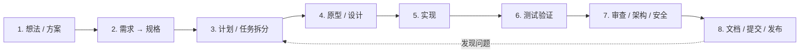

# 我的开发工作流（Personal Dev Workflow）

> 适用对象：我自己在 Codex / Cursor / Trae 中做开发时的工作方式。
> 本文件是「人看的操作手册」；机器的自动技能映射见 `~/.agents/AGENTS.md`。

## 一、工作流总览

原则：**先想后写、小步提交、验证过才算完成**。

## 二、阶段细则

| 阶段 | 做什么 | 产出 | 触发/工具 |
| --- | --- | --- | --- |
| 1. 想法/方案 | 明确目标、受众、一句话价值；拷问方案 | 一句话目标 + 验收标准 | `interview-me` / `brainstorming` / `grill-me` |
| 2. 需求→规格 | 写清背景、边界、用户故事、验收标准 | `SPEC.md` | `to-spec` / `spec-driven-development` |
| 3. 计划 | 把任务拆成可验证的小步（每步 ≤ 一次提交） | `PLAN.md` | `writing-plans` / `planning-and-task-breakdown` |
| 4. 原型/设计 | 先做最小可验证形态；前端定视觉方向 | 原型 / 设计稿 | `prototype` / `frontend-design` / `api-and-interface-design` |
| 5. 实现 | 按计划小步实现，测试先行，外科手术式修改 | 代码 + 测试 | `tdd` / `karpathy-guidelines` |
| 6. 测试验证 | 单测、端到端、界面验证 | 绿色测试报告 | `python-testing-patterns` / `playwright` / `webapp-testing` |
| 7. 审查/架构/安全 | 自查代码质量、影响面、安全风险 | 审查结论 | `code-review` / `gitnexus-review` / `security-best-practices` |
| 8. 文档/提交/发布 | README/CHANGELOG、Git 提交、打 Tag | 干净的工作区 | `writing-guidelines` / `git-workflow-and-versioning` / `yeet` |

## 三、Git 提交规范（本机强制规则）

1. **必须提交**：任何文件修改/版本变更，在本轮交付前必须 `git add -A && git commit`；不把变更留在未提交状态。
2. **原子提交**：一个提交只做一件事；格式：`<type>: <短描述>`，type 用 `feat / fix / docs / refactor / test / chore / ci`。
3. **消息要真实**：写明“改了什么、为什么”，禁止 `update`、`1` 这类无意义消息。
4. **多变更拆分**：一个任务含多个独立变更单元时，按逻辑拆成多次提交。
5. **提交前检查**：
   - `git diff --staged` 确认范围；
   - 确认无密钥/Token/私钥（`.env` 不进库）；
   - 测试通过；格式化与行为变更分开提交。
6. **收尾确认**：任务结束前 `git status` 应为干净状态。

## 四、完成定义（Definition of Done）

- [ ] 需求、边界、验收标准已明确（有歧义时先问，不猜）
- [ ] 计划拆分成可验证的小步
- [ ] 代码通过测试（单测/端到端/界面验证）
- [ ] 关键路径经过审查（架构/安全/性能）
- [ ] 文档（README/CHANGELOG）随变更同步更新
- [ ] 已按原子提交规范提交，`git status` 干净

## 五、每日节奏（示例）

- 早晨：查看 GitHub-AI-Studio 热榜推送 / 定时任务日志，处理异常；
- 白天：按「规格 → 计划 → 实现 → 测试 → 审查 → 提交」推进开发；
- 收尾：提交全部变更、更新 CHANGELOG、`git status` 确认干净、必要时打 Tag。

## 六、如何在新项目启用

1. 把本文件复制到新项目根目录：`WORKFLOW.md`；
2. 按项目语言补充测试/审查命令；
3. 需要机器自动执行时，把阶段映射合并进该项目的 `AGENTS.md`；
4. 需要全局生效时，合并进 `~/.agents/AGENTS.md`（需要时再操作）。
